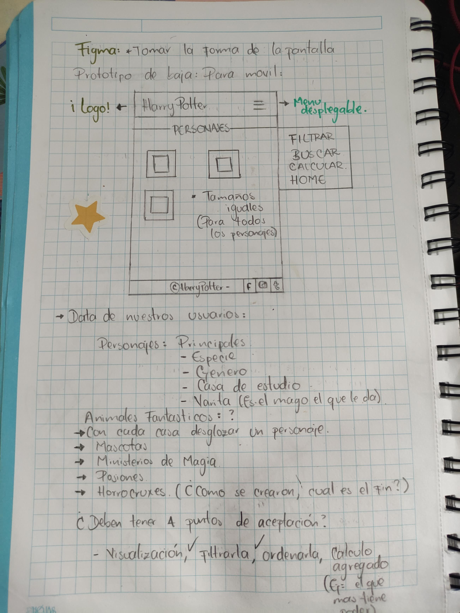

# HARRY POTTER 

## Definicion del producto 

Nuestra pagina web Harry Potter, esta diseñada para almacenar, filtrar y ordenar informacion sobre los personajes de la saga, ademas de eso puedes  encontrar informacion sobre los libros y algunos datos curiosos. 

# ¿A quien va dirigido?

Nuestra pagina web, va dirigida a aquellas personas que son fan o les guste el contenido de la saga de Harry Potter.

# ¿Cuáles son los objetivos del usuario con relación al producto?

Conocer aquellos datos que en ciertos momentos no resaltan en las peliculas enfatizandose en los personajes, como conocer su casa, su varita y su patronus.

# ¿Cómo el producto resuelve el problema del usuario?

La pagina web recolecta informacion sobre los personajes y libros, le muestra la data de tal manera que pueda ser visualizada y accesible de una forma interactiva, ya que se plasma en unas cards con datos cortos, precisos y de facil lectura, ademas el usuario podra acceder en diferentes dispositivos : Pc, tablet, mobile.

# Historias de usuario 

## Primera historia de usuario 

Yo como usuarix visualizar los personajes 

- El usuarix va a tener una pagina inicial donde encontrara un boton. 

- Al dar click en el boton "descubrira la magia". 

- El usuarix tendra la oopcion de 4 imagenes donde podra esocoger que informacion desea conocer. 

- Al dar click en una de esas opciones podra obtener los personajes que pertenecen a esa casa, con su informacion. 

- Los nombres de los personajes se mostraran de manera desordenada. 

- El usuarix tendra un boton con dos opciones para mostrar los datos organizados alfabeticamente de acuerdo a la eleccion. 

## Segunda historia de usuario 

Al tener completada la primer historia quisimos darle un poco mas de informacion valiosa para el usuarix. 

- El usuarix tendra acceso a otra parte de la pagina. 

- Al darle click a "Books" se podra visualizar contenido enfocado en los libros. 

- Se podra visualizar en forma de cards con contenido preciso de cada uno de los 8 libros. 

- La informacion que se mostrara seran : titulo del libro, fecha de publicacion y la descripcion del mismo. 

## Tercer historia de usuario 

En esta historia quisimos hacer otra vista mas donde el usuarix pudiera obtener datos extraños sobre la saga. 

- El usuarix tendra acceso a otra parte de la pagina. 

- Al darle click a "Curious Fact" se podra visualizar contenido enfocado en los datos extraños. 

- Los datos curiosos vienen escritos en porcentajes. 

- Esto se podra visualizar en una seccion unica, para todos los datos. 

# Diseño de la interfaz de usuario 

  ## Prototipo de baja fidelidad 

  s

 ## Prototipo de alta fidelidad 

 Link a [Figma](https://www.figma.com/proto/qMzcivjixbEdIrJVRlvYGW/Untitled?node-id=1%3A2&scaling=scale-down&page-id=0%3A1&starting-point-node-id=1%3A2)

 ## Visualizacion Final 

 # 
 # 
 # 
 # 

Respecto a los colores y diseño nos enfocamos en los colores de las casas, y ese estilo un poco antiguo de Harry Potter.

### Color de fondo de las casas 
- #530505 Casa Gryffindor 
- #2B6B2 Casa Slytherin 
- #205D6 Casa Ravenclaw 
- #957401 Casa Hufflepuff 

### Color de fondo de Books y Curious Fact 
- #B7955B 

### Fuente Elegida 
- 'Cinzel', serif . 

#

